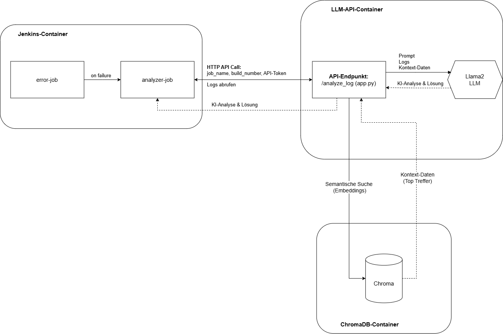

# Erweiterte, isolierte Fehleranalyse mit lokalem LLM & RAG

Dieses Projekt zeigt eine praktische Umsetzung, wie Jenkins-Workflows mithilfe eines **lokalen Large Language Models (Llama-2)** und einer internen Wissensdatenbank (**ChromaDB – Retrieval-Augmented Generation, RAG**) automatisiert analysiert und optimiert werden können – und zwar vollständig ohne Internetzugriff in einer isolierten Umgebung.

---

## 📖 Inhaltsverzeichnis

- [🔥 Projektziel](#-projektziel)
- [📌 Architektur & Workflow](#-architektur--workflow)
- [📜 Skripte & Dateien](#-skripte--dateien)
- [⚙️ Demonstrierter Fehlerfall](#️-demonstrierter-fehlerfall)
- [🛠️ Nutzung & Einrichtung](#️-nutzung--einrichtung)
- [🔗 Projektkomponenten im Detail](#-projektkomponenten-im-detail)
  - [Jenkins-Container](jenkins-container.md)
  - [LLM-API-Container](llm-api-container.md)
  - [ChromaDB-Container](chromadb-container.md)
- [📄 Übersicht der Skripte & Dateien](skripte-und-dateien.md)

---

## 🔥 Projektziel

Ziel des Projekts ist es, die Vorteile einer KI-gestützten Fehleranalyse in Jenkins **ohne Internetverbindung** anhand eines realistischen, reproduzierbaren Beispiels zu demonstrieren.  

---

## 📌 Architektur & Workflow

**Ablauf:**
1. Jenkins-Build schlägt fehl.
2. Analyse-Job wird automatisch gestartet.
3. Jenkins sendet über HTTP Build-Daten an die lokale LLM-API.
4. API liest Jenkins-Logs, sucht in der ChromaDB nach Kontext.
5. Prompt mit Jenkins-Logs und Kontext aus der ChromaDB werden an das LLM gesendet.
6. LLM erstellt eine Analyse samt Lösungsvorschlägen.
7. Ergebnis landet als `analysis_report.txt` im Jenkins-Workspace.

---

## ⚙️ Demonstrierter Fehlerfall

Der demonstrierte Fehlerfall (`cp target/app.jar /opt/myapp/`) ist exakt auf den gespeicherten Kontext in der ChromaDB abgestimmt, um die Wirksamkeit der Analyse zu beweisen.

---

## 🛠️ Nutzung & Einrichtung

- Alle Container laufen in einem isolierten Docker-Netzwerk (`llm-net`).
- Kein externer Traffic erlaubt (vollständig isoliert).
- Einrichtung siehe [Scripts & Dateien](scripts-und-dateien.md).

---

## 🔗 Projektkomponenten im Detail

| Container | Zweck | Doku |
|-----------|-------|------|
| **Jenkins** | Fehleranalyse-Job, Docker-Handling | [→ jenkins-container.md](jenkins-container.md) |
| **LLM API** | Lokales LLM (Llama-2), API-Endpoint | [→ llm-api-container.md](llm-api-container.md) |
| **ChromaDB** | Embeddings, semantische Suche (RAG) | [→ chromadb-container.md](chromadb-container.md) |

---

## 📄 [Skripte & Dateien](skripte-und-dateien.md)

Alle verwendeten Skripte und Dateien inkl. kurzer Beschreibung sind hier dokumentiert.

